# 🎯 **Modern Text Editor - A Feature-Rich Python GUI Application** 🚀

## 🎨 **Screenshots Gallery**

*📸 Screenshots coming soon! Add your own screenshots to the `screenshots/` folder*

### **🎯 Main Interface (Dark Theme)**
`screenshots/dark_theme.png`  
*Professional dark interface with intuitive toolbar and clean text area*

### **☀️ Light Theme**
`screenshots/light_theme.png`  
*Elegant light theme perfect for daytime coding sessions*

### **🔍 Advanced Search**
`screenshots/search.png`  
*Intelligent search with real-time highlighting and navigation*

### **🎤 Voice Features**
`screenshots/voice_recording.png`  
*Live voice-to-text conversion and text-to-speech in action*

### **🌐 Multi-Language Support**
`screenshots/arabic_text.png`  
*Arabic/English text direction detection*

## 🚀 **Quick Start Guide**

### **📦 Installation in 3 Simple Steps:**

```bash
# 1. Clone the repository
git clone https://github.com/yourusername/modern-text-editor.git

# 2. Navigate to project
cd modern-text-editor

# 3. Install dependencies
pip install -r requirements.txt

# 4. Run the application
python text_editor.py
```

### **⚡ One-Liner Installation:**
```bash
git clone https://github.com/yourusername/modern-text-editor.git && cd modern-text-editor && pip install -r requirements.txt && python text_editor.py
```

## 📋 **Requirements File**

```txt
# 🎯 Modern Text Editor - Dependencies
# 📦 Core packages for the ultimate text editing experience

# 🎨 Modern GUI Framework
customtkinter>=5.2.0

# 🖼️ Image Processing
Pillow>=10.0.0

# 📄 Document Processing (read-only support)
python-docx>=1.1.0

# 🎤 Voice Recognition & Synthesis
SpeechRecognition>=3.10.0
gtts>=2.4.0

# 🔊 Audio Playback
pygame>=2.5.0

# 🎯 Optional (for enhanced voice features on Windows)
# pip install pipwin
# pipwin install PyAudio
```

## 🏗️ **Architecture Overview**

```mermaid
graph TB
    subgraph "🎯 Core Application"
        A[ModernTextEditor<br/>Main Window] --> B[🎤 VoiceManager]
        A --> C[🔍 SearchManager]
        A --> D[📁 FileManager]
        A --> E[🎨 ThemeManager]
        A --> F[↔️ TextDirectionManager]
    end
    
    subgraph "🎤 Voice Features"
        B --> B1[🎤 Voice-to-Text Recording]
        B --> B2[🔊 Text-to-Speech Reading]
        B --> B3[🎯 Real-time Processing]
    end
    
    subgraph "🔍 Search & Navigation"
        C --> C1[🔍 Find & Replace]
        C --> C2[🎯 Highlight All Matches]
        C --> C3[🔄 Navigation Controls]
    end
    
    subgraph "📁 File Operations"
        D --> D1[📄 Multi-format Support]
        D --> D2[💾 Save Prompts]
        D --> D3[📂 File Handling]
    end
    
    subgraph "🎨 UI & Themes"
        E --> E1[🌙 Dark/Light Toggle]
        E --> E2[🌈 Custom Colors]
        E --> E3[🎯 Responsive Design]
    end
    
    subgraph "🌐 Language Support"
        F --> F1[↔️ Direction Detection]
        F --> F2[🌍 Arabic/English Support]
    end
```



## ⭐ **Feature Highlights**

### **🎨 Modern & Professional UI**
- **Dark/Light theme toggle** 🌙/☀️ with one-click switching
- **CustomTkinter-powered** sleek interface
- **Real-time cursor tracking** with line/column display
- **Customizable background colors** with automatic text contrast
- **Responsive design** that works on all screen sizes

### **🎤 Revolutionary Voice Integration**
- **🎤 Voice-to-Text Recording** - Speak and watch your words appear
- **🔊 Text-to-Speech Reading** - Have your text read aloud with natural voices
- **🎯 Real-time processing** with background threading
- **🌐 Google Speech Recognition** integration
- **💾 Audio cleanup** and resource management

### **🔍 Advanced Search & Navigation**
- **🔍 Find & Replace** with dialog interface
- **🎯 Highlight All Matches** - See every occurrence
- **🔄 Find Next/Previous** (F3/Shift+F3) navigation
- **🌈 Color-coded highlighting** (yellow for all, orange for current)
- **📍 Go to Line** for document navigation

### **📁 File Management**
- **📄 Multi-format support** (.txt, .html)
- **📄 .docx file reading** (Word document import)
- **💾 Save As functionality** with file type filtering
- **📂 File operations** with error handling

### **🌐 Language Support**
- **↔️ Text direction detection** - Basic per-line Arabic/English detection
- **🌍 Mixed content handling** - Each line analyzed separately
- **🔤 Font compatibility** for multi-language support

### **⚡ Editing Tools**
- **↩️↪️ Undo/Redo** with history
- **✂️📋📝 Copy/Paste/Cut** with keyboard shortcuts
- **📑 Select All** for document manipulation
- **🕐 Time/Date insertion** with F5 shortcut
- **🔍 Zoom In/Out** with Ctrl++/Ctrl- shortcuts

## 🏗️ **Object-Oriented Architecture**

### **🎯 Clean Class Structure:**
```python
# 🏗️ Professional OOP Architecture
class VoiceManager:           # 🎤 Voice features
class SearchManager:          # 🔍 Search operations  
class FileManager:            # 📁 File handling
class ThemeManager:           # 🎨 UI theming
class TextDirectionManager:   # ↔️ Language detection
class ModernTextEditor:       # 📝 Main application
```

### **✨ SOLID Principles Applied:**
- **✅ Single Responsibility** - Each class has one job
- **✅ Open/Closed** - Easy to extend
- **✅ Liskov Substitution** - Managers are interchangeable
- **✅ Interface Segregation** - Clean, focused interfaces
- **✅ Dependency Inversion** - High-level independence

## 🎮 **User Guide**

### **⌨️ Keyboard Shortcuts Cheat Sheet:**

| Shortcut | Action | Emoji | Description |
|----------|--------|-------|-------------|
| **Ctrl+N** | New File | 📄 | Start fresh document |
| **Ctrl+O** | Open File | 📂 | Open existing file |
| **Ctrl+S** | Save | 💾 | Save current work |
| **Ctrl+Shift+S** | Save As | 💾 | Save with new name |
| **Ctrl+Z** | Undo | ↩️ | Reverse last action |
| **Ctrl+Y** | Redo | ↪️ | Restore undone action |
| **Ctrl+X** | Cut | ✂️ | Cut selection |
| **Ctrl+C** | Copy | 📋 | Copy selection |
| **Ctrl+V** | Paste | 📝 | Paste from clipboard |
| **Ctrl+A** | Select All | 📑 | Select entire document |
| **Ctrl+F** | Find | 🔍 | Open search dialog |
| **F3** | Find Next | ⏭️ | Find next occurrence |
| **Shift+F3** | Find Previous | ⏮️ | Find previous occurrence |
| **Ctrl+H** | Replace | 🔄 | Open replace dialog |
| **Ctrl+G** | Go To | 📍 | Jump to specific line |
| **F5** | Time/Date | 🕐 | Insert current timestamp |
| **Ctrl++** | Zoom In | 🔍 | Increase font size |
| **Ctrl+-** | Zoom Out | 🔍 | Decrease font size |
| **Alt+F4** | Exit | 🚪 | Close application |

### **🎤 Using Voice Features:**

```python
# Voice-to-Text Workflow:
1. Click 🎤 Recorder button (turns red when recording)
2. Speak clearly into your microphone
3. Watch text appear in real-time
4. Click again to stop recording

# Text-to-Speech Workflow:
1. Select text or use entire document
2. Click 🔊 Read button (turns red when reading)
3. Listen to text being read aloud
4. Click again to stop playback
```

### **🔍 Advanced Search Usage:**

```python
# Find Text:
1. Press Ctrl+F or click 🔍 button
2. Enter search term
3. Press Enter or click Find
4. All matches highlighted in yellow
5. Use F3/Shift+F3 to navigate

# Replace Text:
1. Press Ctrl+H or use Edit menu
2. Enter find and replace terms
3. Click Replace All
```

## 🧪 **Code Quality & Structure**

### **🔬 Code Organization:**
- **Clean OOP architecture** with proper separation of concerns
- **Comprehensive docstrings** throughout the codebase
- **Type hints** for better code readability
- **Error handling** for robust operation
- **Manual testing** during development

### **📁 Project Structure:**
```
modern-text-editor/
├── text_editor.py          # Main application source
├── requirements.txt        # Python dependencies
├── README.md              # This documentation
├── screenshots/           # Screenshot directory
└── images/                # Optional icon images
```

## 🤝 **Contributing Guidelines**

### **🌟 We Welcome Contributions!** Here's how to join:

1. **🍴 Fork the repository**
2. **🌿 Create a feature branch** (`git checkout -b feature/AmazingFeature`)
3. **💾 Commit your changes** (`git commit -m 'Add: Amazing Feature'`)
4. **🚀 Push to branch** (`git push origin feature/AmazingFeature`)
5. **🎯 Open a Pull Request**

### **📋 Contribution Standards:**
- ✅ Follow **PEP 8** style guide
- ✅ Write **comprehensive docstrings**
- ✅ Add **type hints** for new functions
- ✅ Ensure **backward compatibility**
- ✅ Update **documentation** accordingly

### **🏆 Good First Issues:**
- 🔧 Add keyboard shortcut customization
- 🌈 Implement syntax highlighting
- 📊 Add word/character count statistics
- 🔌 Create plugin system architecture
- 🌐 Add more language direction support

## 🐛 **Troubleshooting Guide**

### **Common Issues & Solutions:**

| Issue | Solution | Emoji |
|-------|----------|-------|
| **Microphone not detected** | `pip install PyAudio` or `pipwin install PyAudio` on Windows | 🎤 |
| **Arabic text not displaying** | Install Arabic font support on your system | 🌍 |
| **Audio playback issues** | Update pygame: `pip install --upgrade pygame` | 🔊 |
| **Import errors** | Reinstall requirements: `pip install -r requirements.txt` | 📦 |
| **Permission denied errors** | Check file permissions in your working directory | 🔒 |

### **🔧 Basic Debugging:**
```python
# Check voice system
python -c "import speech_recognition; print('Voice system ready')"

# Test audio playback
python -c "import pygame; pygame.mixer.init(); print('Audio system ready')"
```

## 🏆 **Why Choose This Editor?**

### **✅ Advantages:**
- **Voice Integration** - Built-in voice features
- **Multi-language Support** - Basic Arabic/English detection
- **Modern UI** - CustomTkinter framework
- **Object-Oriented Design** - Clean, maintainable code
- **Arabic Support** - RTL text direction

### **🎯 Ideal For:**
- **👩‍💻 Developers** exploring Python GUI development
- **📝 Writers** needing basic voice dictation
- **🌍 Multilingual users** working with Arabic/English
- **🎓 Students** learning OOP and GUI programming
- **💼 Professionals** wanting a customizable text tool

## 📚 **Documentation**

### **📖 Current Documentation:**
- **Source code docstrings** - Comprehensive inline documentation
- **OOP architecture** - Clean class structure and separation
- **This README** - Setup and usage instructions

### **📋 Planned Documentation:**
- External documentation is planned for future versions
- API reference documentation
- Developer guides
- User tutorials

## 👥 **Development Team**

### **👨‍💻 Lead Developer:**
- **Your Name** - Architecture & Core Development

### **🤝 Acknowledgments:**
- **CustomTkinter Community** for the amazing GUI framework
- **Google** for speech recognition and TTS APIs
- **Python Software Foundation** for the incredible language
- **All contributors** who help improve this project

## 📄 **Copyright**

© 2024 All rights reserved.

This software and its source code are proprietary. No permission is granted to copy, modify, distribute, or use this software without explicit written permission from the author.

## 🏆 **Future Plans**

*These are potential future enhancements, not currently implemented:*

- [x] **🎯 OOP Architecture** - SOLID principles applied
- [x] **🎤 Voice Integration** - Complete voice suite
- [x] **🔍 Advanced Search** - Professional find/replace
- [ ] **🔌 Plugin System** - Extensible architecture
- [ ] **☁️ Cloud Sync** - Multi-device synchronization
- [ ] **🤖 AI Integration** - Smart suggestions
- [ ] **📊 Version Control** - Git integration
- [ ] **🌐 Web Version** - Browser-based access
- [ ] **📱 Mobile App** - iOS/Android versions

## 🌟 **Support This Project**

If you find this project helpful, please consider:

1. **⭐ Star the repository** - It helps others find it!
2. **🔗 Fork and contribute** - Add your own features
3. **🐛 Report issues** - Help improve stability
4. **📣 Share with friends** - Spread the word

---

<div align="center">

## 🎉 **Ready to Transform Your Text Editing Experience?**

### **Made with ❤️ using Python & CustomTkinter**

**If you like this project, don't forget to give it a ⭐ on GitHub!**

**Happy Coding!** 🎉💻✨

</div>
